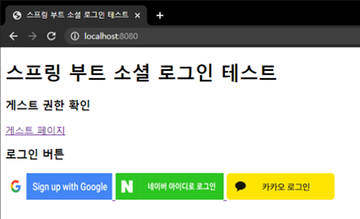
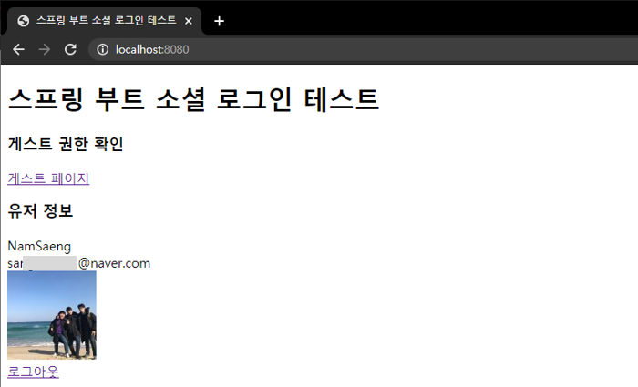

## Social Login Test Project
스프링 부트와 Mustache(프론트엔드 대용)를 사용하여 카카오 등의 소셜 로그인을 구현하여 보는 프로젝트.

## Spring Initializer 설정
- Gradle
- Kotlin
- 2.3.3
- com.namsaeng.sociallogin
- JAVA 8
- Spring Web, Devtools, Mustache

## 실험 방법
**(주의) src/main/resources/application.properties 파일과 src/main/resources/valid-amplifier-289205-firebase-adminsdk-bq7tc-26c30c9c21.json 파일은 Github Repository에 업로드하지 않았으므로 개인적으로 얻어야 함.**
1. MySQL을 설치하고, user 테이블을 생성. 칼럼 구조는 아래 참조.
    - id bigint not null auto_increment primary key
    - name text not null
    - email text not null
    - picture text
    - role text not null 
    - access_token text not null
    - fb_token text
2. 원하는 디렉토리로 이동
3. git clone https://github.com/yurangja99/spring-boot-social-login.git
4. 개인적으로 받은 application.properties 파일에서 spring.datasource.로 시작하는 속성들을 자신의 MySQL 서버에 맞게 수정
5. 프로젝트 디렉토리에서 gradlew bootjar 명령 실행
6. build\libs 폴더로 이동
7. java -jar sociallogin-0.0.1-SNAPSHOT 실행
8. http://localhost:8080에 접속하여 실험

## 진행상황
### 2020/09/10 (#1)
- Initial Commit
- Mustache 연동
### 2020/09/11 (#2)
- 구글 로그인 연동
- 로그아웃과 다른 소셜 계정으로 로그인하는 것은 카카오 로그인도 적용 후 확인하기로 함.
### 2020/09/11 (#3)
- 네이버 로그인 연동
- 서버 재시작 시에도 로그인 정보가 유지되도록 세션 정보를 메모리가 아닌 MySQL에 저장하도록 application.properties 수정
- 카카오 로그인은 아직 오류 원인을 찾지 못해 버튼만 유지한 상태.
- 페이스북 로그인은 구글과 비슷하여 어렵지 않을 것 같으나 필요성을 느끼지 못하여 구현하지 않음.
- 로그인 시 화면에 나오는 이름, 이메일, 프로필 사진이 이상하게 나오는 경우는 있으나, mustache 문법에 대한 이해 부족으로 나타나는 것으로 보임. 서버의 로그와 MySQL 데이터를 보면 잘 나타남을 알 수 있음.
### 2020/09/12 (#4)
- 카카오 로그인 연동
- (#3) 커밋에서 다루었던 (1)서버 재시작 시 로그인 상태 유지, (2)서버 로그에서 사용자 정보가 제대로 나오는 것은 유지됨.
- 현재는 Access Token을 중간에 얻지는 않았으나, Access Token과 Refresh Token 등을 얻어 DB에 같이 저장하는 기능도 구현 예정.
### 2020/09/12 (#5)
- access token을 DB에 저장 (user 테이블에 access_token 칼럼을 text not null 타입으로 추가)
- access token이 expired되면 다시 로그인 화면이 나타나는 것으로 추정
### 2020/09/12 (#6)
- 테스트 코드 작성을 위한 build.gradle.kts, SocialloginApplicationTests.kt 수정
- 이제 "/"에 접속했을 때 "\<h1>스프링 부트 소셜 로그인 테스트\</h1>"의 포함 유무를 통해 메인 화면이 잘 나타나는지 테스트 할 수 있음.
### 2020/09/14 (#7)
- RestController와 JpaRepository를 이용하여 Pageable하게 API를 호출하는 것을 구현함. 앞으로의 프로젝트에서는 데이터가 많은 경우가 있을 것이므로 Pagination된 JpaRepository를 기존의 CrudRepository 대신 쓸 것으로 예상됨. 
- 테스트 코드를 RestTemplate을 이용한 방법과 MockMvc를 이용한 방법, 총 2가지로 구현함. 장단점이 있기 때문에 상황에 맞게 사용하면 될 것 같음. 
- Spring Security가 적용된 프로젝트에서 적절한 권한을 주어 테스트하는 것을 구현함.
### 2020/09/16 (#8)
- LogFactory와 Log를 이용하여 로그를 더욱 형태에 맞게 남김
- guest 페이지에서도 자신의 정보를 볼 수 있도록 수정함.
- 로드 밸런서를 위한 /health 기능을 구현함.
### 2020/09/16 (#9)
- CORS 허용
### 2020/09/19 (#10)
- FCM(Firebase Cloud Message) 서비스를 이용한 푸시 알림 기능 추가
- user 테이블에 fb_token 필드 추가
- 로그인 시, fetch API를 통해 /register로 보낸 요청의 결과가 나오는 문제 발생. 실제 프로젝트에서는 해결 가능할 것으로 보여 그냥 놔두었음.
### 2020/09/19 (#11)
- 푸시 알림에 아이콘 커스터마이징.
- 푸시 알림을 클릭하면 홈페이지가 열리는 것을 구현하려 하였으나, 제대로 작동하지 않았고, 인터넷 익스플로러에서 지원하지 않는다고 하여 보류함.
- 웹에서는 알림이 나오지만, 모바일 환경에서는 테스트 필요. 
- 수정: health check 시 로그 나타내지 않음.